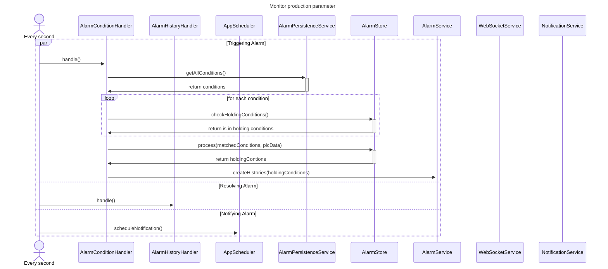

```mermaid
sequenceDiagram 
 title Monitor production parameter
  actor Time as Every second
  participant AlarmConditionHandler
  participant AlarmHistoryHandler
  participant AppScheduler
  participant AlarmPersistenceService
  participant AlarmStore
  participant AlarmService
  participant WebSocketService
  participant NotificationService


  par Triggering Alarm
    Time ->>+ AlarmConditionHandler: handle()
    AlarmConditionHandler ->>+ AlarmPersistenceService: getAllConditions()
    AlarmPersistenceService ->>- AlarmConditionHandler: return conditions
    loop for each condition
      AlarmConditionHandler ->>+ AlarmStore: checkHoldingConditions()
      AlarmStore ->>- AlarmConditionHandler: return is in holding conditions
    end
    AlarmConditionHandler ->>+ AlarmStore: process(matchedConditions, plcData)
    AlarmStore ->>- AlarmConditionHandler: return holdingContions
    AlarmConditionHandler ->>+ AlarmService: createHistories(holdingConditions)
  and Resolving Alarm
    Time ->>+ AlarmHistoryHandler: handle()
  and Notifying Alarm
    Time ->>+ AppScheduler: scheduleNotification()
  end
```