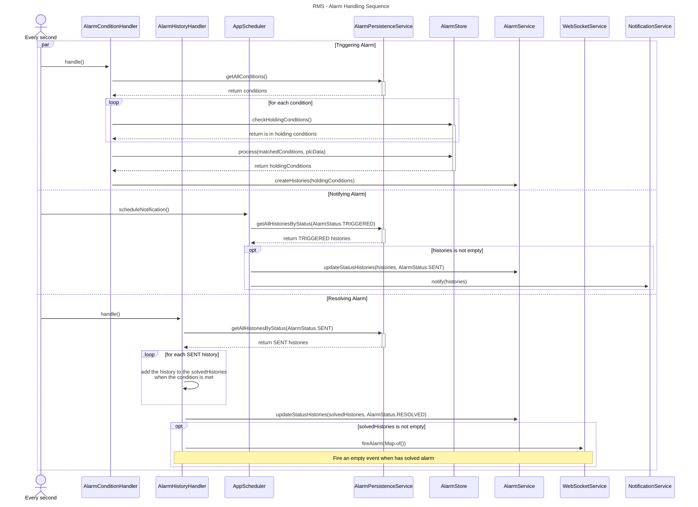

```mermaid
sequenceDiagram 
  title RMS - Alarm Handling Sequence
  actor Time as Every second
  participant AlarmConditionHandler
  participant AlarmHistoryHandler
  participant AppScheduler
  participant AlarmPersistenceService
  participant AlarmStore
  participant AlarmService
  participant WebSocketService
  participant NotificationService

  par Triggering Alarm
    Time ->>+ AlarmConditionHandler: handle()
    AlarmConditionHandler ->>+ AlarmPersistenceService: getAllConditions()
    AlarmPersistenceService -->>- AlarmConditionHandler: return conditions
    loop for each condition
      AlarmConditionHandler ->>+ AlarmStore: checkHoldingConditions()
      AlarmStore -->> AlarmConditionHandler: return is in holding conditions
    end
    AlarmConditionHandler ->> AlarmStore: process(matchedConditions, plcData)
    AlarmStore -->>- AlarmConditionHandler: return holdingConditions
    AlarmConditionHandler ->>+ AlarmService: createHistories(holdingConditions)
  and Notifying Alarm
    Time ->>+ AppScheduler: scheduleNotification()
    AppScheduler ->>+ AlarmPersistenceService: getAllHistoriesByStatus(AlarmStatus.TRIGGERED)
    AlarmPersistenceService -->>- AppScheduler: return TRIGGERED histories
    opt histories is not empty
      AppScheduler ->>+ AlarmService: updateStatusHistories(histories, AlarmStatus.SENT)
      AppScheduler ->>+ NotificationService: notify(histories)
    end
  and Resolving Alarm
    Time ->>+ AlarmHistoryHandler: handle()
    AlarmHistoryHandler ->>+ AlarmPersistenceService: getAllHistoriesByStatus(AlarmStatus.SENT)
    AlarmPersistenceService -->>- AlarmHistoryHandler: return SENT histories
    loop for each SENT history
      AlarmHistoryHandler ->>+ AlarmHistoryHandler: add the history to the solvedHistories <br/> when the condition is met
    end
    AlarmHistoryHandler ->>+ AlarmService: updateStatusHistories(solvedHistories, AlarmStatus.RESOLVED)
    opt solvedHistories is not empty
      AlarmHistoryHandler ->>+ WebSocketService: fireAlarm(Map.of())
      Note over AlarmHistoryHandler,WebSocketService: Fire an empty event when has solved alarm
    end
  end
```