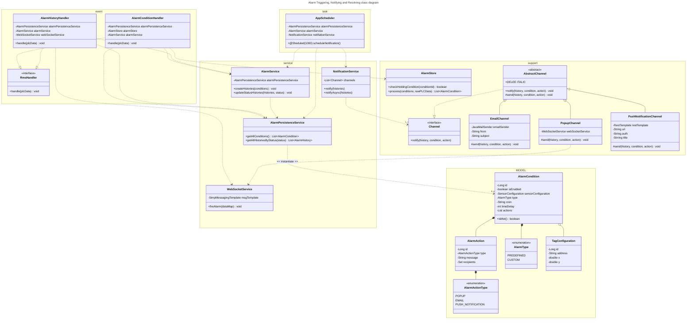

```mermaid 
---
title: Alarm Triggering, Notifying and Resolving class diagram
---
classDiagram
  namespace event {
    class RmsHandler {
      <<interface>>
      +handle(plcData) void
    }

    class AlarmConditionHandler {
      -AlarmPersistenceService alarmPersistenceService
      -AlarmStore alarmStore
      -AlarmService alarmService
      +handle(plcData) void
    } 

    class AlarmHistoryHandler{
      -AlarmPersistenceService alarmPersistenceService
      -AlarmService alarmService
      -WebSocketService webSocketService
      +handle(plcData) void
    }
  }

  %% realization
  AlarmConditionHandler ..|> RmsHandler
  AlarmHistoryHandler ..|> RmsHandler

  %% dependency 
  AlarmConditionHandler ..> AlarmPersistenceService
  AlarmConditionHandler ..> AlarmStore
  AlarmConditionHandler ..> AlarmService

  AlarmHistoryHandler ..> AlarmPersistenceService
  AlarmHistoryHandler ..> AlarmService
  AlarmHistoryHandler ..> WebSocketService

  AlarmService ..> AlarmPersistenceService

  namespace task {
    class AppScheduler{
      -AlarmPersistenceService alarmPersistenceService
      -AlarmService alarmService
      -NotificationService notifiationService

      +@Sheduled(1000) scheduleNotification()
    }
  }

  AppScheduler ..> AlarmPersistenceService
  AppScheduler ..> AlarmService
  AppScheduler ..> NotificationService

  namespace service {
    class WebSocketService{
      -SimpMessagingTemplate msgTemplate 
      +fireAlarm(dataMap) void
    }

    class AlarmPersistenceService {
      +getAllConditions() List~AlarmCondition~
      +getAllHistoriesByStatus(status) List~AlarmHistory~
    }

    class AlarmService {
      -AlarmPersistenceService alarmPersistenceService
      +createHistories(conditions) void
      +updateStatusHistories(histories, status) void
    }

    class NotificationService {
      -List~Channel~ channels
      +notify(histories)
      +notifyAsync(histories)
    }
  }

  AlarmPersistenceService ..> "0..n" AlarmCondition: << instantiate >>
  NotificationService ..> "1..n" Channel

  namespace support {
    class AlarmStore{
      +checkHoldingCondition(conditionId) boolean
      +process(conditions, rawPLCData) List~AlarmCondition~
    }

    class Channel {
      <<interface>>
      +notify(history, condition, action)
    }

    class AbstractChannel {
      <<abstract>>
      +DELEE ITALIC
      +notify(history, condition, action) void
      #send(history, condition, action) void
    }

    class EmailChannel {
      -JavaMailSender emailSender
      -String from
      -String subject
      #send(history, condition, action) void
    }

    class PopupChannel{
      -WebSocketService webSocketService
      #send(history, condition, action) void
    }

    class PushNotificationChannel {
      -RestTemplate restTemplate
      -String url
      -String auth
      -Strring title
      #send(history, condition, action) void
    }
  }

  AbstractChannel ..|> Channel
  AbstractChannel  <|-- EmailChannel
  AbstractChannel  <|-- PopupChannel
  AbstractChannel  <|-- PushNotificationChannel
  PopupChannel ..> WebSocketService

  namespace MODEL {
    class AlarmCondition{
      -Long id
      -boolean isEnabled
      -SensorConfiguration sensorConfiguration
      -AlarmType type 
      -String cron
      -int timeDelay
      -List<AlarmAction> actions
      +isMet() boolean
    }

    class AlarmAction {
      -Long id
      -AlarmActionType type
      -String message
      -Set<String> recipients
    }

    class AlarmActionType {
      <<enumeration>>
      POPUP
      EMAIL
      PUSH_NOTIFICATION
    }

    class AlarmType {
      <<enumeration>>
      PREDEFINED
      CUSTOM
    } 

    class TagConfiguration {
      -Long id
      -String address
      -double x
      -double y
    }
  }

  AlarmAction *-- AlarmActionType

  AlarmCondition *-- AlarmAction
  AlarmCondition *-- AlarmType
  AlarmCondition o-- TagConfiguration
```