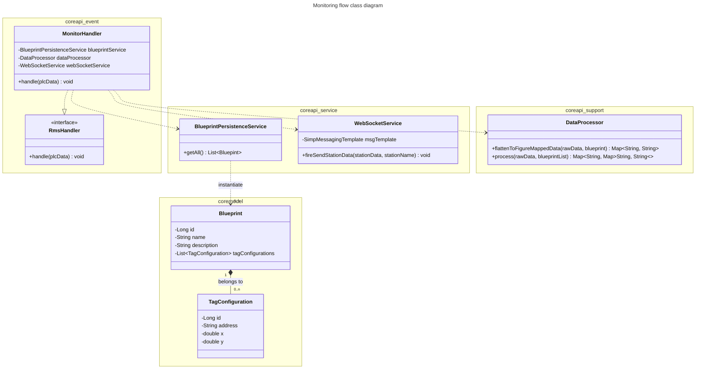

```mermaid 
---
title: Monitoring flow class diagram
---
classDiagram
  namespace coreapi_event {
    class RmsHandler {
      <<interface>>
      +handle(plcData) void
    }

    class MonitorHandler {
      -BlueprintPersistenceService blueprintService
      -DataProcessor dataProcessor
      -WebSocketService webSocketService
      +handle(plcData) void
    }

  }
  MonitorHandler ..|> RmsHandler
  MonitorHandler ..> BlueprintPersistenceService
  MonitorHandler ..> DataProcessor
  MonitorHandler ..> WebSocketService

  namespace coreapi_service {
    class BlueprintPersistenceService {
      +getAll() List~Bluepint~
    }

    class WebSocketService{
      -SimpMessagingTemplate msgTemplate 
      +fireSendStationData(stationData, stationName) void
    }
  }

  BlueprintPersistenceService ..> "0..n" Blueprint: instantiate

  namespace coreapi_support {
    class DataProcessor {
      +flattenToFigureMappedData(rawData, blueprint) Map~String, String~
      +process(rawData, blueprintList) Map~String, Map~String, String~~
    }
  }

  namespace coremodel {
    class Blueprint { 
      -Long id
      -String name 
      -String description
      -List~TagConfiguration~ tagConfigurations
    }

    class TagConfiguration {
      -Long id 
      -String address
      -double x 
      -double y 
    }
  }
  Blueprint "1" *-- "0..n" TagConfiguration: belongs to
```