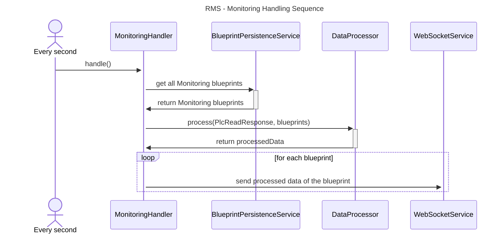

```mermaid
sequenceDiagram
  title RMS - Monitoring Handling Sequence
  actor Time as Every second
  participant MonitoringHandler
  participant BlueprintPersistenceService
  participant DataProcessor
  participant WebSocketService 

  Time ->>+ MonitoringHandler: handle()
  MonitoringHandler ->>+ BlueprintPersistenceService: get all Monitoring blueprints
  BlueprintPersistenceService ->>- MonitoringHandler: return Monitoring blueprints
  MonitoringHandler ->>+ DataProcessor: process(PlcReadResponse, blueprints)
  DataProcessor ->>- MonitoringHandler: return processedData
  loop for each blueprint
    MonitoringHandler ->>+ WebSocketService: send processed data of the blueprint
  end
```