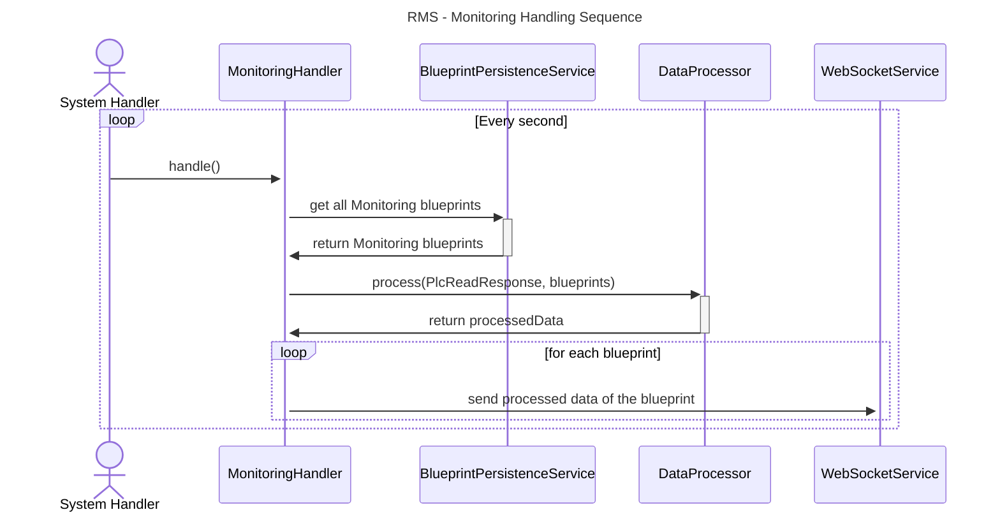

```mermaid
sequenceDiagram
  title RMS - Monitoring Handling Sequence
  actor Time as System Handler
  participant MonitoringHandler
  participant BlueprintPersistenceService
  participant DataProcessor
  participant WebSocketService 

  loop Every second
    Time ->>+ MonitoringHandler: handle()
    MonitoringHandler ->>+ BlueprintPersistenceService: get all Monitoring blueprints
    BlueprintPersistenceService ->>- MonitoringHandler: return Monitoring blueprints
    MonitoringHandler ->>+ DataProcessor: process(PlcReadResponse, blueprints)
    DataProcessor ->>- MonitoringHandler: return processedData
    loop for each blueprint
      MonitoringHandler ->>+ WebSocketService: send processed data of the blueprint
    end
  end
```