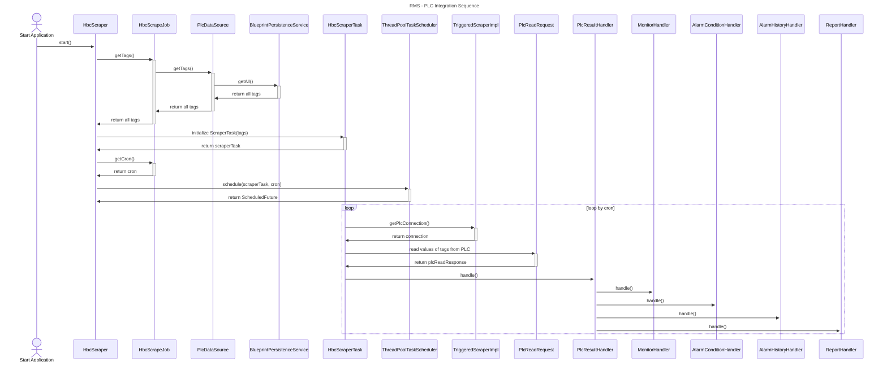

```mermaid
sequenceDiagram 
  title RMS - PLC Integration Sequence
  actor Init as Start Application
  participant HbcScraper
  participant HbcScrapeJob
  participant PlcDataSource
  participant BlueprintPersistenceService
  participant HbcScraperTask 
  participant ThreadPoolTaskScheduler
  participant TriggeredScraperImpl
  participant PlcReadRequest
  participant PlcResultHandler
  participant MonitorHandler
  participant AlarmConditionHandler
  participant AlarmHistoryHandler
  participant ReportHandler

  Init ->>+ HbcScraper: start()
  HbcScraper ->>+ HbcScrapeJob: getTags()
  HbcScrapeJob ->>+ PlcDataSource: getTags()
  PlcDataSource ->>+ BlueprintPersistenceService: getAll()
  BlueprintPersistenceService ->>- PlcDataSource: return all tags
  PlcDataSource ->>- HbcScrapeJob: return all tags
  HbcScrapeJob ->>- HbcScraper: return all tags
  HbcScraper ->>+ HbcScraperTask: initialize ScraperTask(tags)
  HbcScraperTask ->>- HbcScraper: return scraperTask
  HbcScraper ->>+ HbcScrapeJob: getCron() 
  HbcScrapeJob ->>- HbcScraper: return cron
  HbcScraper ->>+ ThreadPoolTaskScheduler: schedule(scraperTask, cron)
  ThreadPoolTaskScheduler ->>- HbcScraper: return ScheduledFuture
  loop loop by cron
    HbcScraperTask ->>+ TriggeredScraperImpl: getPlcConnection()
    TriggeredScraperImpl ->>- HbcScraperTask: return connection
    HbcScraperTask ->>+ PlcReadRequest: read values of tags from PLC
    PlcReadRequest ->>- HbcScraperTask: return plcReadResponse
    HbcScraperTask ->>+ PlcResultHandler: handle()
    PlcResultHandler ->>+ MonitorHandler: handle()
    PlcResultHandler ->>+ AlarmConditionHandler: handle()
    PlcResultHandler ->>+ AlarmHistoryHandler: handle()
    PlcResultHandler ->>+ ReportHandler: handle()
  end
```