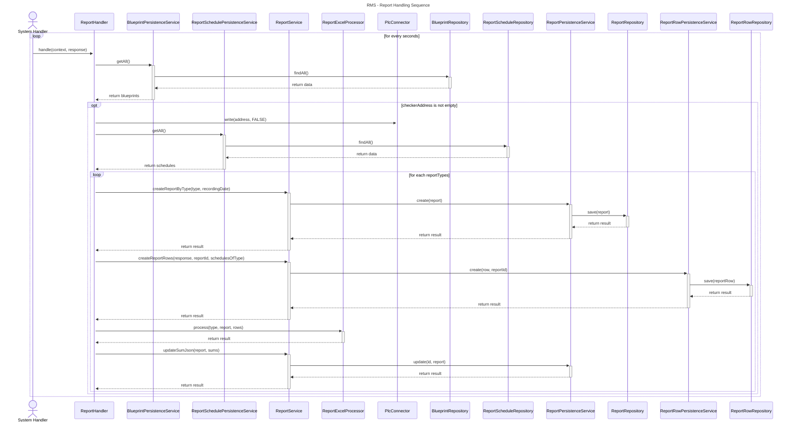

```mermaid
sequenceDiagram 
title RMS - Report Handling Sequence
  actor Time as System Handler
  participant ReportHandler
  participant BlueprintPersistenceService
  participant ReportSchedulePersistenceService
  participant ReportService
  participant ReportExcelProcessor
  participant PlcConnector
  participant BlueprintRepository

loop for every seconds
    Time ->>+ ReportHandler: handle(context, response)
    ReportHandler ->>+ BlueprintPersistenceService: getAll()
    BlueprintPersistenceService ->>+ BlueprintRepository: findAll()
    BlueprintRepository -->>- BlueprintPersistenceService: return data
    BlueprintPersistenceService -->>- ReportHandler: return blueprints
    opt checkerAddress is not empty
        ReportHandler ->>+ PlcConnector: write(address, FALSE)
        ReportHandler ->>+ ReportSchedulePersistenceService: getAll()
        ReportSchedulePersistenceService ->>+ ReportScheduleRepository: findAll()
        ReportScheduleRepository -->>- ReportSchedulePersistenceService: return data
        ReportSchedulePersistenceService -->>- ReportHandler: return schedules
        loop for each reportTypes
            ReportHandler ->>+ ReportService: createReportByType(type, recordingDate)
            ReportService ->>+ ReportPersistenceService: create(report)
            ReportPersistenceService ->>+ ReportRepository: save(report)
            ReportRepository -->>- ReportPersistenceService: return result
            ReportPersistenceService -->>- ReportService: return result
            ReportService -->>- ReportHandler: return result

            ReportHandler ->>+ ReportService: createReportRows(response, reportId, schedulesOfType)
            ReportService ->>+ ReportRowPersistenceService: create(row, reportId)
            ReportRowPersistenceService ->>+ ReportRowRepository: save(reportRow)
            ReportRowRepository -->>- ReportRowPersistenceService: return result
            ReportRowPersistenceService -->>- ReportService: return result
            ReportService -->>- ReportHandler: return result

            ReportHandler ->>+ ReportExcelProcessor: process(type, report, rows)
            ReportExcelProcessor -->>-ReportHandler: return result
            ReportHandler ->>+ ReportService: updateSumJson(report, sums)
            ReportService ->>+ ReportPersistenceService: update(id, report)
            ReportPersistenceService -->>- ReportService: return result
            ReportService -->>- ReportHandler: return result
        end
    end
    end
```
