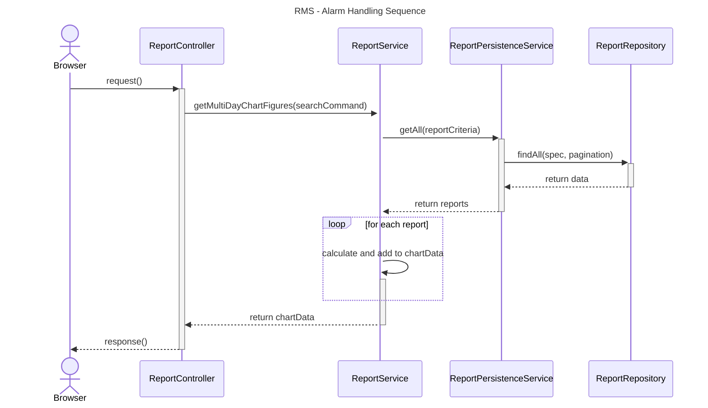

```mermaid
sequenceDiagram 
 title RMS - Alarm Handling Sequence
  actor Browser
  participant ReportController
  participant ReportService
  participant ReportPersistenceService
  participant ReportRepository

    Browser ->>+ ReportController: request()
    ReportController ->>+ ReportService: getMultiDayChartFigures(searchCommand)
    ReportService ->>+ ReportPersistenceService: getAll(reportCriteria)
    ReportPersistenceService ->>+ ReportRepository: findAll(spec, pagination)
    ReportRepository -->>- ReportPersistenceService: return data
    ReportPersistenceService -->>- ReportService: return reports
    loop for each report
       ReportService ->>+ ReportService: calculate and add to chartData
    end
    ReportService -->>- ReportController: return chartData
    ReportController -->>- Browser: response()

```
