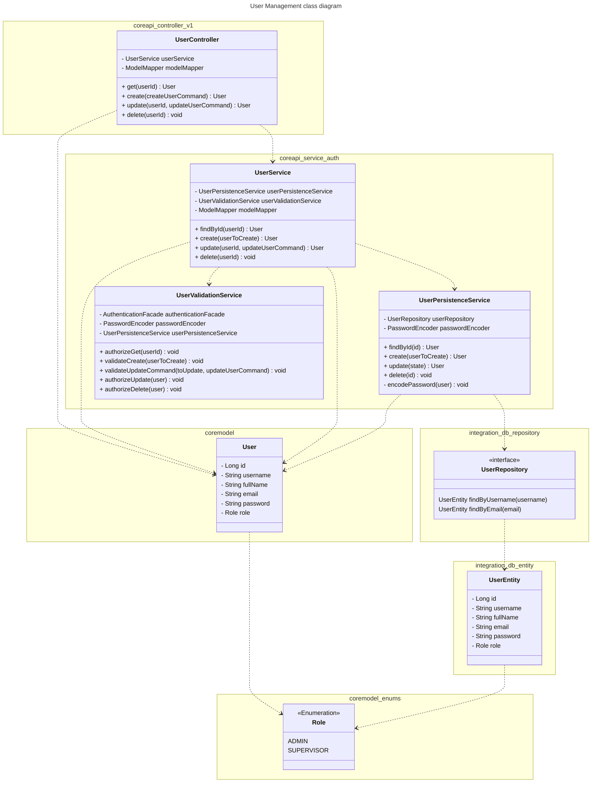

```mermaid 
---
title: User Management class diagram
---
classDiagram
  namespace coreapi_controller_v1 {
    class UserController {
      - UserService userService
      - ModelMapper modelMapper
      + get(userId) User
      + create(createUserCommand) User
      + update(userId, updateUserCommand) User
      + delete(userId) void 
    }
  }

  namespace coreapi_service_auth {
    class UserService {
      - UserPersistenceService userPersistenceService
      - UserValidationService userValidationService
      - ModelMapper modelMapper
      + findById(userId) User
      + create(userToCreate) User
      + update(userId, updateUserCommand) User
      + delete(userId) void
    }

    class UserPersistenceService {
      - UserRepository userRepository
      - PasswordEncoder passwordEncoder
      + findById(id) User
      + create(userToCreate) User
      + update(state) User
      + delete(id) void
      - encodePassword(user) void
    }

    class UserValidationService {
      - AuthenticationFacade authenticationFacade
      - PasswordEncoder passwordEncoder
      - UserPersistenceService userPersistenceService
      + authorizeGet(userId) void
      + validateCreate(userToCreate) void
      + validateUpdateCommand(toUpdate, updateUserCommand) void
      + authorizeUpdate(user) void
      + authorizeDelete(user) void
    }
  }

  namespace integration_db_repository {
    class UserRepository {
      <<interface>>
      UserEntity findByUsername(username)
      UserEntity findByEmail(email)
    }
  }

  namespace coremodel {
    class User {
      - Long id
      - String username
      - String fullName
      - String email
      - String password
      - Role role
    }
  }

  namespace coremodel_enums {
    class Role {
      <<Enumeration>>
      ADMIN
      SUPERVISOR
    }
  }

  namespace integration_db_entity {
    class UserEntity {
      - Long id
      - String username
      - String fullName
      - String email
      - String password
      - Role role
    }
  }

  UserController ..> UserService
  UserController ..> User
  UserService ..> UserPersistenceService
  UserService ..> User
  UserService ..> UserValidationService
  UserService ..> User
  UserPersistenceService ..> UserRepository
  UserPersistenceService ..> User
  UserRepository ..> UserEntity
  User ..> Role
  UserEntity ..> Role
```