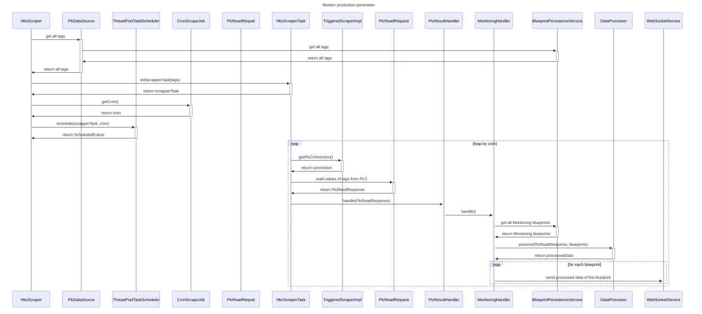

```mermaid
sequenceDiagram
  title Monitor production parameter
  participant HbcScraper
  participant PlcDataSource
  participant ThreadPoolTaskScheduler
  participant CronScrapeJob
  participant PlcReadRequet
  participant HbcScraperTask
  participant TriggeredScraperImpl
  participant PlcReadRequest
  participant PlcResultHandler
  participant MonitoringHandler
  participant BlueprintPersistenceService
  participant DataProcessor
  participant WebSocketService 

  HbcScraper ->>+ PlcDataSource: get all tags 
  PlcDataSource ->>+ BlueprintPersistenceService: get all tags
  BlueprintPersistenceService ->>- PlcDataSource: return all tags
  PlcDataSource ->>- HbcScraper: return all tags

  HbcScraper ->>+ HbcScraperTask: initScrapperTask(tags)
  HbcScraperTask ->>- HbcScraper: return scrapperTask

  HbcScraper ->>+ CronScrapeJob: getCron() 
  CronScrapeJob ->>- HbcScraper: return cron
  HbcScraper ->>+ ThreadPoolTaskScheduler: schedule(scrapperTask, cron)
  ThreadPoolTaskScheduler ->>- HbcScraper: return ScheduledFuture


  loop loop by cron
    HbcScraperTask ->>+ TriggeredScraperImpl: getPlcConnection()
    TriggeredScraperImpl ->>- HbcScraperTask: return connection
    HbcScraperTask ->>+ PlcReadRequest: read values of tags from PLC
    PlcReadRequest ->>- HbcScraperTask: return PlcReadResponse
    HbcScraperTask ->>+ PlcResultHandler: handle(PlcReadResponse)
    PlcResultHandler ->>+ MonitoringHandler: handle()
    MonitoringHandler ->>+ BlueprintPersistenceService: get all Monitoring blueprints
    BlueprintPersistenceService ->>- MonitoringHandler: return Monitoring blueprints
    MonitoringHandler ->>+ DataProcessor: process(PlcReadResponse, blueprints)
    DataProcessor ->>- MonitoringHandler: return processedData
    loop for each blueprint
      MonitoringHandler ->>+ WebSocketService: send processed data of the blueprint
    end
  end
```