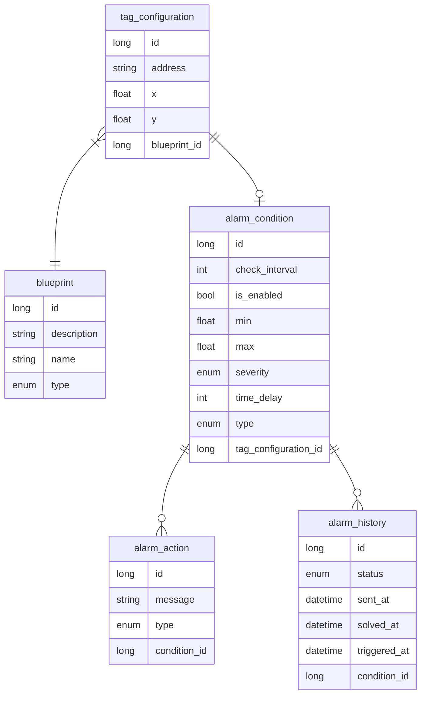

```mermaid
erDiagram
  tag_configuration }|--|| blueprint: ""
  tag_configuration ||--o| alarm_condition: ""
  tag_configuration {
    long id
    string address
    float x
    float y
    long blueprint_id
  }

  blueprint {
    long id
    string description
    string name
    enum type
  }

  alarm_condition ||--o{ alarm_action: ""
  alarm_condition ||--o{ alarm_history: ""
  alarm_condition {
    long id 
    int check_interval
    bool is_enabled
    float min
    float max 
    enum severity
    int time_delay
    enum type
    long tag_configuration_id
  }

  alarm_history {
    long id 
    enum status
    datetime sent_at
    datetime solved_at
    datetime triggered_at
    long condition_id
  }

  alarm_action {
    long id 
    string message
    enum type
    long condition_id
  }

```